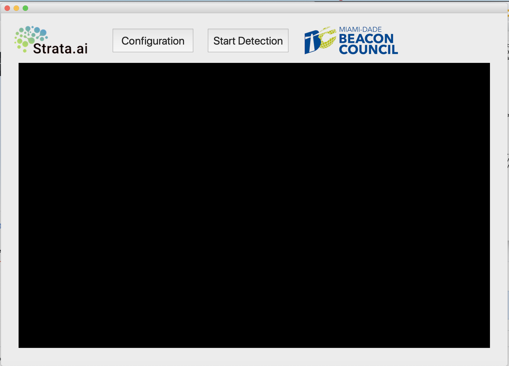
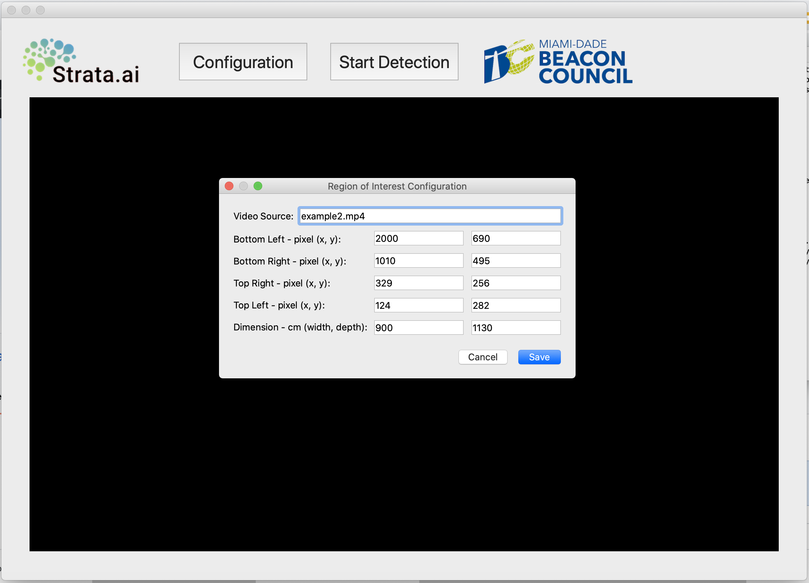

# Social Distance Detector


The Social Distancing Detector (aka SDD) is a computer-vision based application that analyzes video feeds to detect whether individuals are appropriately social distancing from each other. This software was developed for the Miami-Dade Beacon Council's 1MPACT initiative by [Strata.ai](https://www.strata.ai/) to assist with business reopening in the wake of the COVID-19 pandemic shutdown. 

This softare was developed to be open-source and free for all Miami-Dade (and beyond) Businesses to use in their retail locations, public spaces, and/or primarily any high-foot-trafficked areas.


## What you need installed:
- Python 3.7
- OpenCV(CV2) 4.2
- PyQt5
- numpy 1.14
- argparse


## Installation &nbsp;
**With [Python](https://www.python.org/) installed:**
```sh
# Get the latest repository version of SDD
$ git clone https://github.com/Strata-ai/Social-Distancing-Detector.git

```

## Running the Application:

**From terminal:**
```sh
# Change directory to SDD directory 
$ cd Social-Distancing-Detector

# Run the python program
$ python main.py

# You should see a window like below:
```



## Configuration:

```sh
# Click on "configuration" button 
# You should see teh following dialog:
```



## Compatibility
SDD is built primarily with Python and will operate within any modern version of Windows or MacOS.


## Links
- [Strata.ai Website](http://strata.ai/)
- [Miami-Dade Beacon Council Website](http://)


## Team
SDD is actively maintained with the help of many amazing contributors

[Strata.ai](https://sailsjs.com/about) is a strategy and venture building firm focused on the exponentiality of Decision Science, Artificial Intelligence, and Extended Reality.
 
We partner with the world’s largest organizations to solve, develop, and scale robust solutions through meaningful innovation and with a hyper-focus on measurable impact.

## License

[MIT License](https://opensource.org/licenses/MIT)  Copyright © 2020-present, Strata.ai
